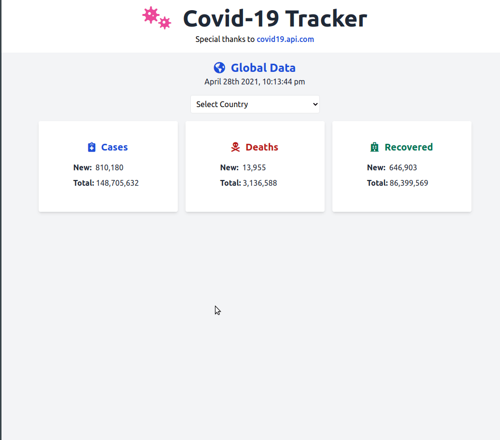

# Covid Tracker

A simple web application developed with Vue and Tailwind CSS that allows users to view global statistics about the impact of the Covid-19.

You can [view the live application](https://mdillemuth-covid-tracker.netlify.app/)

## Demo



## Built With

- Vue
- Tailwind CSS

## API

The app makes use of the [Covid 19 API](https://covid19api.com)

## Vue Create

This app was started with [vue create](https://cli.vuejs.org/guide/creating-a-project.html)

### Project setup

```
npm install
```

### Compiles and hot-reloads for development

```
npm run serve
```

### Compiles and minifies for production

```
npm run build
```

### Customize configuration

See [Configuration Reference](https://cli.vuejs.org/config/).

## Credits

I would like to thank [Brad Traversy](https://twitter.com/traversymediag) for providing a [comprehensive tutorial for this project](https://www.youtube.com/watch?v=m-MAIpnH9ag).

The code in my repository was first written along with the tutorial before personalized modifications to the UI were made.
